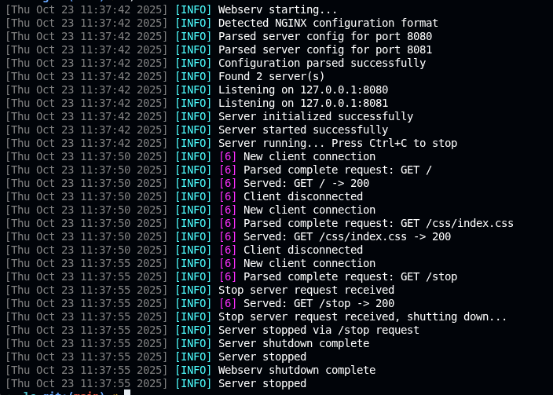

# Webserv Project

## Overview
Webserv is a lightweight HTTP/1.1 server built entirely in C++. It serves static assets, executes CGI scripts, and exposes a configurable routing layer inspired by NGINX. The codebase implements its own epoll-based event loop, request parser, response builder, and logging utility.

## Features
- Non-blocking IO backed by an epoll manager with custom callback dispatch.
- Static file serving with MIME type detection and graceful error pages.
- CGI execution with environment preparation and body streaming.
- Upload handling and configurable locations via `webserv.conf` or YAML.
- Colored runtime logging with adjustable verbosity.

## Architecture At A Glance
- **Request lifecycle:** The `Server` accepts connections, `Client` buffers track per-socket state, `HTTPParser` incrementally fills an `HTTPRequest`, and `FileServer`/`CGIHandler` produce an `HTTPResponse` that is streamed back through the same client.
- **Event loop:** `EpollManager` (`src/core/Epoll.*`) maps file-descriptor events to function pointers so the server can react to readable, writable, and error states without blocking.
- **Configuration:** `Config` and `ServerConfig` (`src/config/`) parse NGINX-style and YAML files, building location rules, upload limits, and CGI directives that the runtime references on every request.
- **Utilities:** `Logger` (`src/utils/Logger.*`) formats colored log lines with timestamps and optional file-descriptor context; `Utils` and `String` provide path, time, and string helpers shared across the modules.

### Example: Bootstrapping the server
```cpp
// src/main.cpp
Config config;
if (!config.parseNginx("webserv.conf")) return 1;

Server server;
Server::setSignalInstance(&server);
if (!server.init(&config) || !server.start()) return 1;

Logger::setLevel(INFO);
server.run();
server.stop();
```
The `main` routine validates the configuration, registers signal handlers, and then hands control to `Server::run()`, which blocks inside the epoll loop until shutdown.

### Example: Routing and response generation
```cpp
// src/core/Server.cpp (excerpt)
void Server::generateHttpResponse(Client& client, const HTTPRequest& request) {
    ServerConfig* serverConfig = _config->getServerByPort(request.getPort());
    const LocationConfig* location = serverConfig->findLocation(request.getURI());

    if (location && location->cgi_enabled &&
        Utils::endsWith(request.getURI(), location->cgi_extension)) {
        std::string uri = request.getURI();
        std::string scriptPath = location->root + uri.substr(location->path.length());
        CGIHandler handler(request, *location, scriptPath);
        HTTPResponse response;
        if (handler.execute(response)) {
            client.setWriteBuffer(response.toString());
            return;
        }
    }

    HTTPResponse response = FileServer::serveFile(request, *serverConfig);
    client.setWriteBuffer(response.toString());
}
```
The server resolves the virtual host, applies location rules, detects CGI requests, and delegates either to `CGIHandler` or the static `FileServer` to populate the response buffer returned to the client.

## Configuration
- `webserv.conf` ships with two server blocks demonstrating static hosting, file uploads, CGI execution, and a `/stop` administrative endpoint.
- YAML configuration is also supported; files ending in `.yml`/`.yaml` are parsed automatically.
- Locations can enable CGI with `cgi_extension`, customize roots, index files, autoindex, upload destinations, and more.

## Build & Run
```bash
make            # build all targets into ./webserv
./webserv webserv.conf
```
Point your browser (or `curl`) to `http://localhost:8080` to explore the static demo and CGI samples in `cgi-bin/`.

## Logging & Monitoring
The `Logger` utility prints timestamped, colorized events. Adjust verbosity with:
```cpp
Logger::setLevel(DEBUG);
```
Sample log excerpt captured during a local run (ANSI colors removed for clarity):


Use these logs to trace request lifecycles, confirm CGI execution, and diagnose configuration issues.

## Project Layout
```
Makefile         # Build entry point
stress_test.sh   # High-level curl stress scenarios
webserv          # Compiled server binary
webserv.conf     # Default configuration (NGINX syntax)
cgi-bin/         # Sample CGI scripts (PHP, Python)
errors/          # Custom HTML error pages
src/             # C++ sources (core, http, config, cgi, utils)
static/          # Public static assets and HTML demos
uploads/         # Destination for file uploads
```

## Testing & Diagnostics
- **Stress testing:** `./stress_test.sh` drives heavy concurrent GET/POST mix; add `siege` or `wrk` for deeper benchmarks.
- **Memory analysis:** `valgrind --leak-check=full --track-fds=yes ./webserv webserv.conf`
- **Manual smoke tests:** `curl -v http://localhost:8080/`, `curl -v http://localhost:8080/cgi-bin/hello.php`, and `curl -F "file=@README.md" http://localhost:8080/upload`.

## Dependencies
The project depends only on the C++ standard library and POSIX sockets/epoll. No third-party packages are required.
